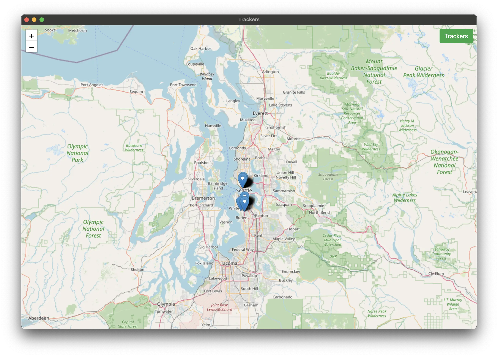
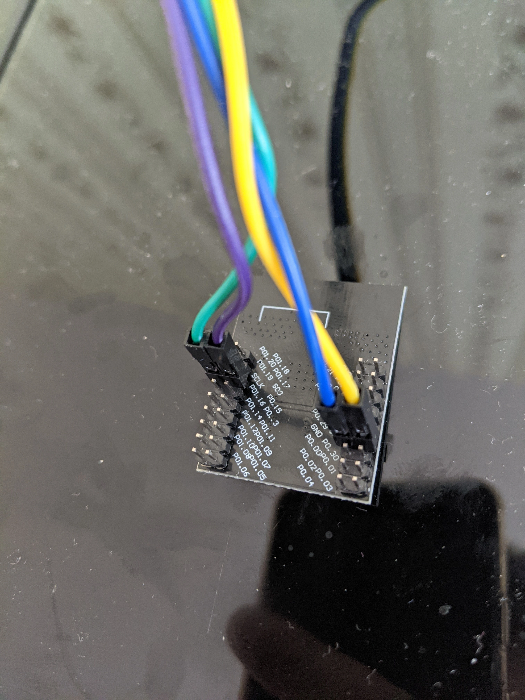
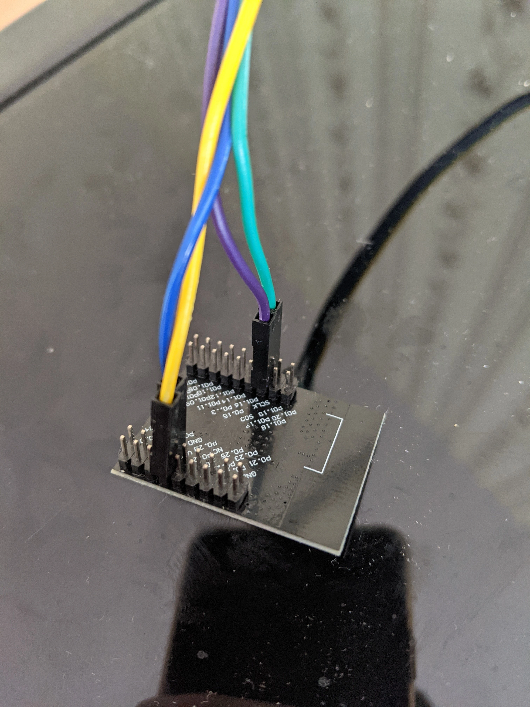
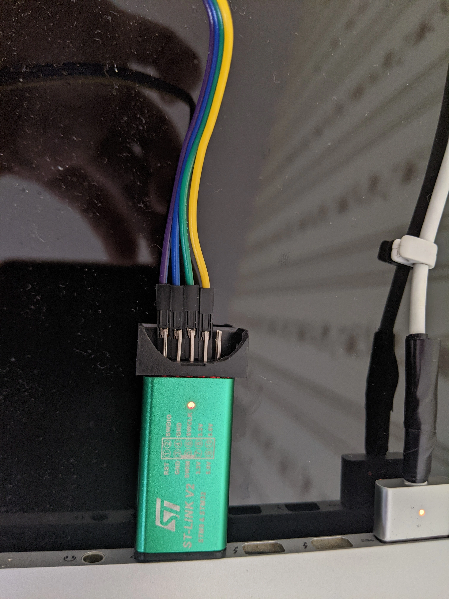

# intro

An app allows one to see the locations of the open haystack trackers



# omg. how to use it?

```shell
./run.sh
```

Click on the Trackers button and put the trackers configuration, for example
```json
[
    {
        "name": "microbit",
        "key_id": "DIf2Od7NcEfYHsFVQTC/xTUFecr3J8B0KoPfJHsXRQM=",
        "advertisement_key": "f9dQjCafB68gi9ZKLH/iQsN9tScDX+zXF4BfZGDqoyA=",
        "private_key": "7b1MPYzazUCpDzTUDO9RM2h+2VytFGe0Sdua8A=="
    }
]
```

Then tracker positions has to be displayed on the map.

The web UI never asks for a password. Authentication is a **one-time** Apple ID
login done in a terminal - see [sign in to Apple (once)](#sign-in-to-apple-once)
below. Do that before the first run, or the UI will just tell you to.

Existing trackers keep working: the `private_key` values you already flashed are
unchanged, so **no re-flashing is required** by this migration.

# sign in to Apple (once)

Locations come from Apple's Find My network via
[FindMy.py](https://pypi.org/project/FindMy/) (`FindMy==0.10.2`, imported as
`findmy`). It needs an authenticated Apple ID session. Anisette data is produced
locally by FindMy.py's `LocalAnisetteProvider` - there is no Docker container and
no third-party anisette server involved.

Run this once, interactively:

```shell
pipenv run python tools/findmy_login.py
```

It prompts for your Apple ID, then the password (read with `getpass`: not echoed,
not logged, not written anywhere), then walks you through 2FA (trusted-device code
or SMS). On success it prints `Signed in as ...` and saves the session.

```
usage: tools/findmy_login.py [-h] [--account-file ACCOUNT_FILE] [--force]
                             [--apple-id APPLE_ID]
```

| argument | what it does |
|---|---|
| `--apple-id APPLE_ID` | Apple ID (email). Prompted for when omitted. The password is *always* prompted for. |
| `--account-file ACCOUNT_FILE` | Where to store the session. Default: `$FINDMY_ACCOUNT_FILE`, else `$XDG_CONFIG_HOME/openhaystack-web/account.json`, else `~/.config/openhaystack-web/account.json`. |
| `--force` | Log in again even when a valid session already exists. Without it the script detects the existing session, prints `Nothing to do.` and exits 0. |

## read this before you log in

These are real constraints of Apple's GSA ("grandslam") authentication, not
conservative guesses:

1. **App-specific passwords do NOT work.** GSA predates them. You must use the
   real Apple ID password plus interactive two-factor authentication. There is no
   headless/unattended way to do this first login.
2. **Every fresh login registers another trusted device on your Apple ID.** These
   accumulate, and an Apple ID with too many of them eventually starts refusing
   sign-ins. Log in once and reuse the saved session. That is exactly why
   `tools/findmy_login.py` refuses to re-login unless you pass `--force` - don't
   pass it casually.
3. **Brand-new Apple IDs are sometimes rejected** with an "account score not high
   enough" error. Nothing in this repo can work around that; use an established
   Apple ID.

## the session file

| path | what |
|---|---|
| `~/.config/openhaystack-web/account.json` | the Apple account session, written **mode 0600** in a `0700` directory |
| `~/.config/openhaystack-web/anisette-libs.bin` | cached anisette libraries, so later starts load locally instead of re-downloading |

Overrides: `$FINDMY_ACCOUNT_FILE` for the session file, `$FINDMY_ANISETTE_LIBS`
for the libs cache; `$XDG_CONFIG_HOME` is honoured for the directory.

`account.json` is a **live Apple credential** - treat it like `~/.ssh/id_rsa`. It
is gitignored and must never be committed. If it is lost or corrupt, the app says
so and you re-run the login tool.


# for developers

## install requirements

```shell
brew install python3
python3 -m pip install pipenv
pipenv sync
```

Python 3.10 or newer is required (`FindMy==0.10.2` is pinned to
`python_version >= '3.10' and python_version < '3.15'`); CI uses 3.12.

`pipenv sync` installs exactly what `Pipfile.lock` pins (with hash verification) -
`eel` is pinned to `==0.18.2` and `FindMy` to `==0.10.2`, so don't replace it with a
plain `pipenv install` unless you intend to move those pins.
`./run.sh` does this for you on the first run.

Run the app:

```shell
pipenv run python3 app.py
```

`openocd` is only needed if you are going to flash a MCU:

```shell
brew install openocd
```

## run the tests

```shell
pipenv run python -m unittest discover -s tests
```

48 tests, no network and no Apple credentials required (the Find My calls are
mocked). Nothing in `tests/` imports `objc` or touches the macOS keychain, so the
suite runs on Linux as well as macOS - CI runs it on `ubuntu-latest`.

## generate keys

```shell
pipenv run ./tools/keygen.py
```

Generates a new airtag keys, use an advertisement_key for the next ste
```json
{
    "key_id": "DIf2Od7NcEfYHsFVQTC/xTUFecr3J8B0KoPfJHsXRQM=",
    "advertisement_key": "f9dQjCafB68gi9ZKLH/iQsN9tScDX+zXF4BfZGDqoyA=",
    "private_key": "7b1MPYzazUCpDzTUDO9RM2h+2VytFGe0Sdua8A=="
}
```

## connect MCU to STLink





## flashing

```shell
pipenv run ./tools/flash.py --advertisement-key=$KEY
```
Wait for `** Programming Finished **`.

It should output like this
```
Open On-Chip Debugger 0.12.0
Licensed under GNU GPL v2
For bug reports, read
	http://openocd.org/doc/doxygen/bugs.html
WARNING: interface/stlink-v2.cfg is deprecated, please switch to interface/stlink.cfg
Info : auto-selecting first available session transport "hla_swd". To override use 'transport select <transport>'.
Info : The selected transport took over low-level target control. The results might differ compared to plain JTAG/SWD
Info : clock speed 1000 kHz
Info : STLINK V2J25S4 (API v2) VID:PID 0483:3748
Info : Target voltage: 3.234442
Info : [nrf51.cpu] Cortex-M0 r0p0 processor detected
Info : [nrf51.cpu] target has 4 breakpoints, 2 watchpoints
Info : starting gdb server for nrf51.cpu on 3333
Info : Listening on port 3333 for gdb connections
[nrf51.cpu] halted due to debug-request, current mode: Handler HardFault
xPSR: 0x41000003 pc: 0x00000c7a msp: 0x20003fd0
Info : nRF51822-QFAA(build code: H0) 256kB Flash, 16kB RAM
Info : Mass erase completed.
Info : A reset or power cycle is required if the flash was protected before.
[nrf51.cpu] halted due to debug-request, current mode: Thread
xPSR: 0xc1000000 pc: 0xfffffffe msp: 0xfffffffc
** Programming Started **
Warn : Adding extra erase range, 0x0000374c .. 0x000037ff
** Programming Finished **
** Verify Started **
** Verified OK **
[nrf51.cpu] halted due to debug-request, current mode: Thread
xPSR: 0xc1000000 pc: 0x00000c3c msp: 0x20004000
** Programming Started **
Warn : Adding extra erase range, 0x0000374c .. 0x000037ff
** Programming Finished **
```

## test that it works

To get locations of the tracker
Put keys in array into "trackers.json" as in examble below
It needs time to advertise the tracker by the nearby iPhones, wait about 10m

```shell
pipenv run ./tools/locations.py                      # reads ./trackers.json
pipenv run ./tools/locations.py trackers.json        # or pass the path
pipenv run ./tools/locations.py --config trackers.json
pipenv run ./tools/locations.py trackers.json --hours 6
pipenv run ./tools/locations.py trackers.json --format raw
```

| argument | default | what it does |
|---|---|---|
| `CONFIG` (positional, optional) | `trackers.json` | path to the trackers JSON |
| `--config CONFIG` | `trackers.json` | same thing; passing both forms exits with code 2 |
| `--hours HOURS` | `24` | how far back to look for reports, must be > 0 |
| `--format {json,raw}` | `json` | `json` prints `{name: [{lat, lng, accuracy, reported_at}]}`, `raw` prints the same mapping as a python `repr` |

The default output is JSON; `--format raw` prints the python `repr` of the same
`{name: [...]}` mapping. The config file may be a single JSON object instead of a
list - it is wrapped into a one-element list.

`trackers.json` holds tracker **private keys** and is gitignored - don't commit it.

### trackers.json schema

Validation lives in `lib/trackers.py` and is shared by the eel app and the REST
backend.

| field | required | rules |
|---|---|---|
| `private_key` | **yes** | base64 P-224 private key. Everything else is derived from it (`findmy.KeyPair.from_b64`). An unparseable value is rejected by index, never echoing the key material. |
| `key_id` | no | derived from `private_key` as `KeyPair.hashed_adv_key_b64`. If you *do* supply it and it disagrees with the private key, the app raises a loud `ValueError` rather than silently querying a different tag. |
| `advertisement_key` | no | advisory; checked against `KeyPair.adv_key_b64` the same way when present. |
| `name` | no | falls back to the derived `key_id`. It is the key of the results object, so unnamed trackers would otherwise all collide. |

Keypairs you flashed before the FindMy.py migration are still correct:
`KeyPair.from_b64(private_key).adv_key_b64` and `.hashed_adv_key_b64` reproduce
exactly the `advertisement_key` and `key_id` already on your tags. **You do not
need to re-flash anything.**

trackers.json example

```json
[
	{
		"name": "My tracker",
		"key_id": "DIf2Od7NcEfYHsFVQTC/xTUFecr3J8B0KoPfJHsXRQM=",
		"advertisement_key": "f9dQjCafB68gi9ZKLH/iQsN9tScDX+zXF4BfZGDqoyA=",
		"private_key": "7b1MPYzazUCpDzTUDO9RM2h+2VytFGe0Sdua8A=="
	}
]
```

### the `--hours` window

`--hours` (and the `hours` argument of `lib.trackers.get_tracker_locations`,
default `24`) bounds how far back reports are returned. FindMy.py 0.10.2 has no
server-side time window, so Apple is asked for the full history for each key and
the cutoff is applied **client side** on `LocationReport.timestamp`; results are
returned sorted oldest-first. `tools/locations.py` rejects a value <= 0 with exit
code 2; in the library a `None` or non-positive value means "no filtering".

## firmware

The firmware defines the status LED on GPIO P0.17. Connect your LED (with a suitable series resistor) to that pin, or change the STATUS_LED_PIN definition in firmware/src/main.c if you want to use a different pin

## references

[Low-power consumption firmare](https://github.com/acalatrava/openhaystack-firmware/releases/tag/0.1)

## how to build a openhaystack tracker

1. [Building Nordic NRF51822 Airtag tutorial](https://dzianisv.github.io/notes/Embedded/Nordic-NRF51822-Airtag.html)
2. [How to generate a key pair and flash a firmware to the MCU](https://github.com/dzianisv/openhaystack-toolkit/blob/main/README.md)


# optional REST backend

`app.py` (eel) talks to python directly. If that's not available the web UI falls back
to a REST backend, `backend/app.py` (sanic):

```shell
pipenv run python backend/app.py
```

No credentials are passed on the command line. The server restores the same
`~/.config/openhaystack-web/account.json` session that `tools/findmy_login.py`
wrote, once per process, and reuses that one `AppleAccount` for every request -
re-provisioning anisette on each request is what gets an Apple ID rate-limited.

A missing or broken session does **not** stop the server from starting: it logs a
warning and retries lazily, so a login performed while the server is running is
picked up without a restart.

Endpoints:

| endpoint | what |
|---|---|
| `POST /api/v1/locations` | body `{"trackers": [...]}`, returns `{name: [{lat, lng, accuracy, reported_at}]}` over a fixed 24 hour window |
| `GET /api/v1/health` | always 200; `account_configured` / `account_session_loaded` tell you whether anyone has logged in yet |

Status codes from `POST /api/v1/locations`: `400` for a malformed body or an
invalid/inconsistent tracker list, `503` when no Apple session is configured or the
saved one is unusable (run the login tool; no restart needed), `502` when the
upstream Find My lookup fails. Error bodies are deliberately generic - the detail
goes to the server log, because the underlying exceptions embed the account file
path and therefore the local username.

| env var | default | meaning |
|---|---|---|
| `BIND_HOST` (or `HOST`) | `127.0.0.1` | address to bind |
| `PORT` | `8000` | port to bind |
| `ALLOWED_ORIGINS` | `http://localhost:<port>,http://127.0.0.1:<port>` (and `:8000`) | comma separated CORS origins |
| `FINDMY_ACCOUNT_FILE` | `$XDG_CONFIG_HOME/openhaystack-web/account.json` | session file to restore |
| `FINDMY_ANISETTE_LIBS` | next to the account file | anisette libs cache |

⚠️ **The endpoint is unauthenticated.** It accepts tracker private keys and returns
physical location history to anyone who can reach it. Keep it on loopback; binding
`BIND_HOST` to anything else publishes your trackers to the network (the server logs a
warning when you do).


## Files used

| path | mode | what |
|---|---|---|
| `~/.config/openhaystack-web/account.json` | `0600` in a `0700` dir | Apple ID session from `tools/findmy_login.py`. A live credential. Gitignored; never commit it. Override with `$FINDMY_ACCOUNT_FILE`. |
| `~/.config/openhaystack-web/anisette-libs.bin` | `0600` in a `0700` dir | cached anisette libraries, avoids a download on every start. Override with `$FINDMY_ANISETTE_LIBS`. |
| `./trackers.json` | - | tracker private keys. Gitignored; never commit it. |

`$XDG_CONFIG_HOME` is honoured for the config directory. Writes are atomic
(`mkstemp` -> `chmod 0600` -> `fsync` -> `os.replace`), so an interrupted write can
never leave a half-written or world-readable credential.

There is no longer any macOS keychain, iCloud token cache, or 12-hour expiry: the
Apple session is reused until Apple invalidates it, at which point the app tells
you to re-run `tools/findmy_login.py`.

