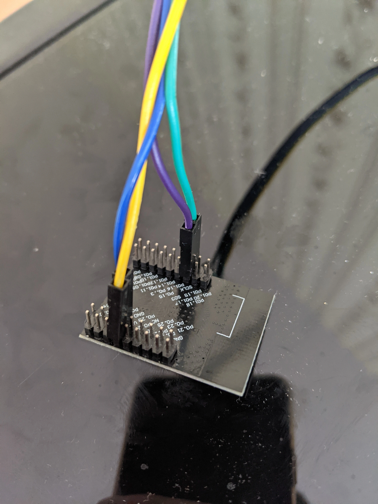
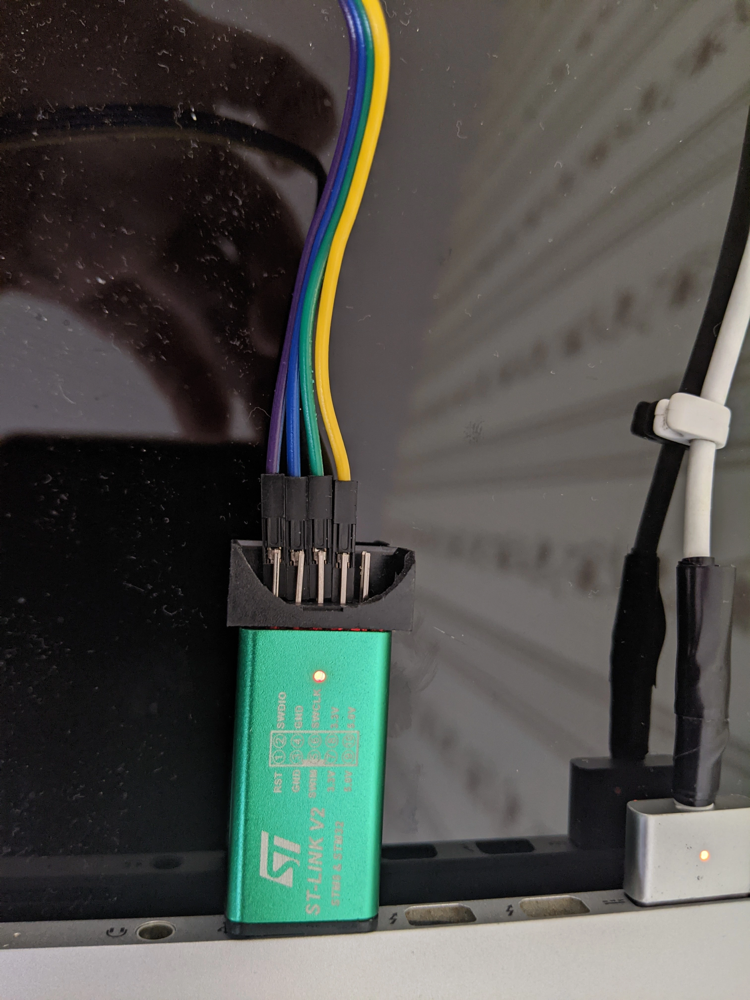

# intro

An app allows one to see the locations of the open haystack trackers


# omg. how to use it?

```shell
./run.sh
```

Click on the Trackers button and put the trackers configuration, for example
```json
[
    {
        "name": "microbit",
        "key_id": "",
        "private_key": ""
    }
]
```

Then tracker positions has to be displayed on the map.


# for developers

## install requirements

```shell
brew install python3 openocd
python3 -m pipenv
git submodule update --init --recursive
pipenv install
```

## generate keys

```shell
pipenv run ./tools/keygen.py
```

Generates a new airtag keys, use an advertisement_key for the next ste
```json
{
    "key_id": "DIf2Od7NcEfYHsFVQTC/xTUFecr3J8B0KoPfJHsXRQM=",
    "advertisement_key": "f9dQjCafB68gi9ZKLH/iQsN9tScDX+zXF4BfZGDqoyA=",
    "private_key": "7b1MPYzazUCpDzTUDO9RM2h+2VytFGe0Sdua8A=="
}
```

## connect MCU to STLink





## flashing

```shell
pipenv run ./tools/flash.py --advertisement-key=$KEY
```
Wait for `** Programming Finished **`.

It should output like this
```
Open On-Chip Debugger 0.12.0
Licensed under GNU GPL v2
For bug reports, read
	http://openocd.org/doc/doxygen/bugs.html
WARNING: interface/stlink-v2.cfg is deprecated, please switch to interface/stlink.cfg
Info : auto-selecting first available session transport "hla_swd". To override use 'transport select <transport>'.
Info : The selected transport took over low-level target control. The results might differ compared to plain JTAG/SWD
Info : clock speed 1000 kHz
Info : STLINK V2J25S4 (API v2) VID:PID 0483:3748
Info : Target voltage: 3.234442
Info : [nrf51.cpu] Cortex-M0 r0p0 processor detected
Info : [nrf51.cpu] target has 4 breakpoints, 2 watchpoints
Info : starting gdb server for nrf51.cpu on 3333
Info : Listening on port 3333 for gdb connections
[nrf51.cpu] halted due to debug-request, current mode: Handler HardFault
xPSR: 0x41000003 pc: 0x00000c7a msp: 0x20003fd0
Info : nRF51822-QFAA(build code: H0) 256kB Flash, 16kB RAM
Info : Mass erase completed.
Info : A reset or power cycle is required if the flash was protected before.
[nrf51.cpu] halted due to debug-request, current mode: Thread
xPSR: 0xc1000000 pc: 0xfffffffe msp: 0xfffffffc
** Programming Started **
Warn : Adding extra erase range, 0x0000374c .. 0x000037ff
** Programming Finished **
** Verify Started **
** Verified OK **
[nrf51.cpu] halted due to debug-request, current mode: Thread
xPSR: 0xc1000000 pc: 0x00000c3c msp: 0x20004000
** Programming Started **
Warn : Adding extra erase range, 0x0000374c .. 0x000037ff
** Programming Finished **
```

## test that it works

To get locations of the tracker
Put keys in array into "trackers.json" as in examble below
It needs time to advertise the tracker by the nearby iPhones, wait about 10m

```shell
pipenv run ./tools/locations.py tracker.json
```

trackers.json example

```json
[
	{
		"name": "My tracker",
		"key_id": "DIf2Od7NcEfYHsFVQTC/xTUFecr3J8B0KoPfJHsXRQM=",
		"advertisement_key": "f9dQjCafB68gi9ZKLH/iQsN9tScDX+zXF4BfZGDqoyA=",
		"private_key": "7b1MPYzazUCpDzTUDO9RM2h+2VytFGe0Sdua8A=="
	}
]
```

## references

[Low-power consumption firmare](https://github.com/acalatrava/openhaystack-firmware/releases/tag/0.1)

## how to build a openhaystack tracker

1. [Building Nordic NRF51822 Airtag tutorial](https://dzianisv.github.io/notes/Embedded/Nordic-NRF51822-Airtag.html)
2. [How to generate a key pair and flash a firmware to the MCU]([https://github.com/dzianisv/openhaystack-toolkit](https://github.com/dzianisv/openhaystack-toolkit/blob/main/README.md))


# dev environment

1. Install system requirements (macOS example):
```shell
brew install python3
python3 -m pip install pipenv
git submodule update --init --recursive
pipenv install
```

2. Install python requirements

```shell
pipenv install
pipenv run python3 app.py
```


## Files used

~/.config/icloud
$HOME/Library/Application Support/iCloud/Accounts/