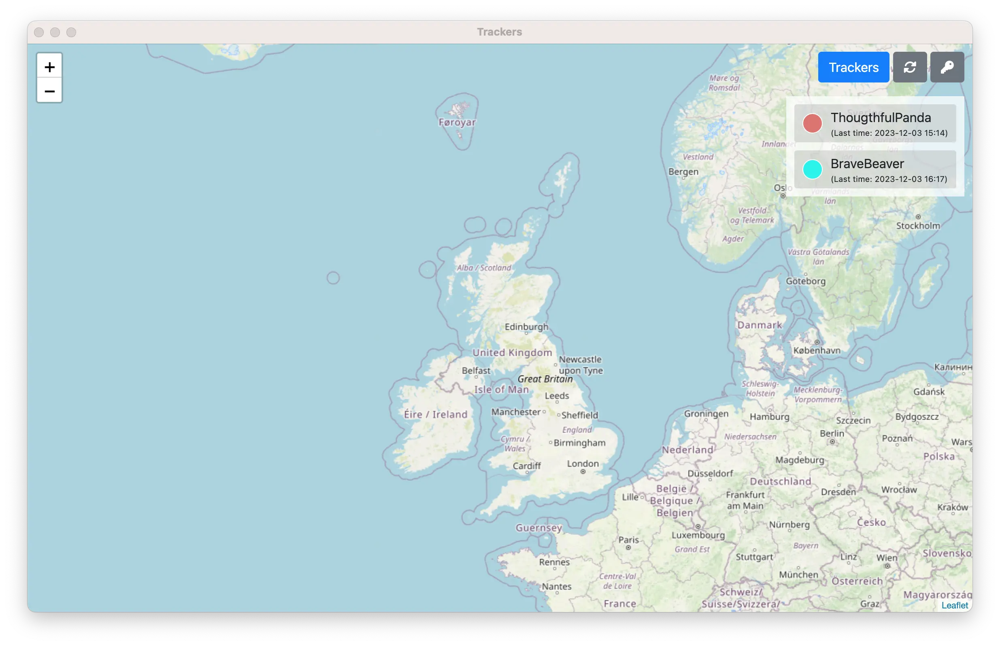

# intro

An app allows to see locations of the openhaystack trackers



# for users

```shell
./run.sh
```

Click on the Trackers button and put the trackers configuration, for example
```json
[
    {
        "name": "microbit",
        "key_id": "",
        "private_key": ""
    }
]
```

Then tracker positions has to be displayed on the map.


# for developers 

## how to build a openhaystack tracker

- [Nordic NRF51822 Airtag tutorial](https://dzianisv.github.io/notes/Embedded/Nordic-NRF51822-Airtag.html)
- [openhaystack-toolkit](https://github.com/dzianisv/openhaystack-toolkit)

## dev requirements

```shell
brew install python3
python3 -m pip install pipenv
git submodule update --init --recursive
pipenv install
```


```shell
pipenv install
pipenv run python3 app.py
```
